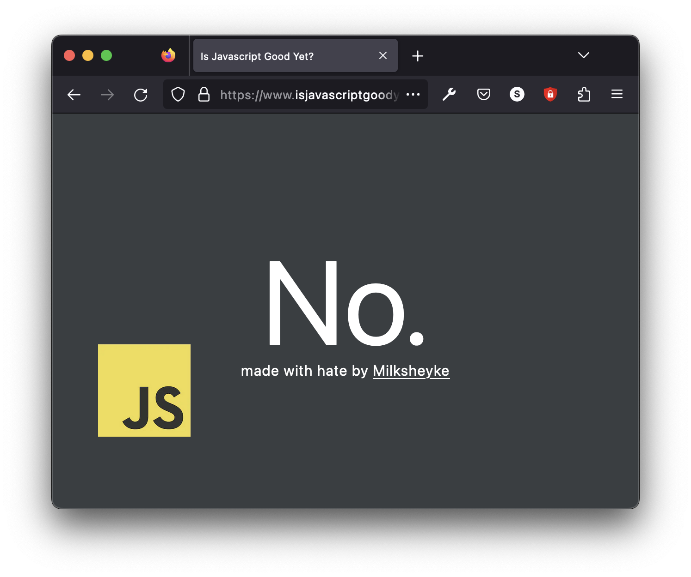

# isjavascriptgoodyet?

https://isjavascriptgoodyet.com is the one source of truth in regards to the current goodness state of Javascript.

## Overview

"Is JavaScript Good Yet?" is a 100% accurate status monitoring website that displays the overall rating of the current state of Javascript.

## Features

- Using NextJS to display 6 words and an image.
- Load time of 0.32s
- Minimalistic design.
- Mobile responsive.

## Getting Started

### Prerequisites

Frustration and a web browser to view the site, or a text editor if you wish to view the source.

## Contributing

If you have any ideas to showcase the worst practices of Javascript, feel free to open a pull request.

## License

This project is licensed under the finders keepers license. 

## Acknowledgments

- Oracle for not DMCA-ing me yet.
- The vibrant dev community for constantly making memes about JavaScript.